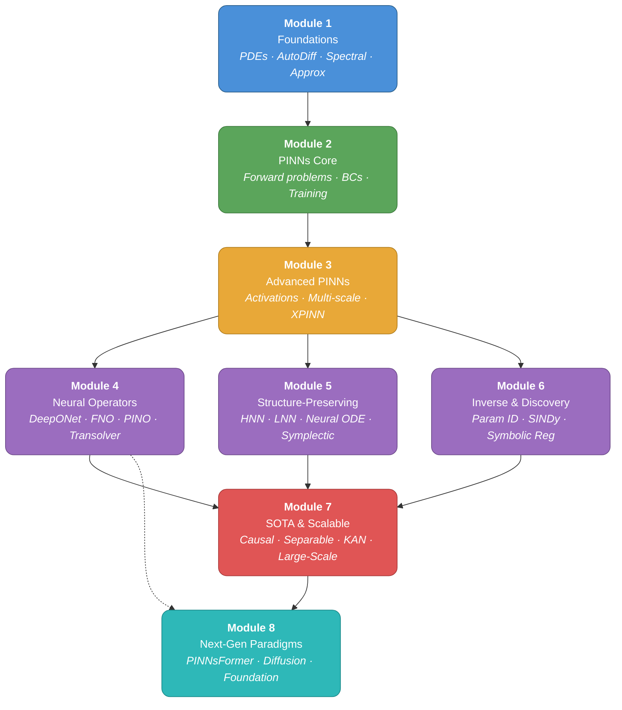

# Physics-Informed Learning: From Fundamentals to SOTA

> A self-contained, notebook-driven course covering physics-informed machine learning — from PDE basics and vanilla PINNs through neural operators, structure-preserving networks, equation discovery, and cutting-edge scalable methods. **Built entirely on NumPy, PyTorch, and SciPy — no high-level API wrappers.**

---

## Table of Contents

- [Why This Repo?](#why-this-repo)
- [Module Overview](#module-overview)
  - [Module 1 · Mathematical & Computational Foundations](#module-1--mathematical--computational-foundations)
  - [Module 2 · Physics-Informed Neural Networks (PINNs)](#module-2--physics-informed-neural-networks-pinns)
  - [Module 3 · Advanced PINN Architectures](#module-3--advanced-pinn-architectures)
  - [Module 4 · Neural Operators](#module-4--neural-operators)
  - [Module 5 · Structure-Preserving Neural Networks](#module-5--structure-preserving-neural-networks)
  - [Module 6 · Inverse Problems & Equation Discovery](#module-6--inverse-problems--equation-discovery)
  - [Module 7 · SOTA & Scalable Methods](#module-7--sota--scalable-methods)
  - [Module 8 · Next-Generation Paradigms (2024–2026)](#module-8--next-generation-paradigms-20242026)
- [Suggested Learning Path](#suggested-learning-path)
- [Prerequisites](#prerequisites)
- [Tech Stack](#tech-stack)
- [Getting Started](#getting-started)
- [Notebook Convention](#notebook-convention)
- [Key References](#key-references)
- [License](#license)

---

## Why This Repo?

Physics-informed learning sits at the intersection of scientific computing and deep learning. Traditional numerical solvers are well-understood but expensive; pure data-driven models are fast but ignore known physics. Physics-informed methods combine the best of both worlds by embedding physical laws (PDEs, conservation laws, symmetries) directly into neural network training.

This repository provides a **structured, hands-on curriculum** that builds intuition from first principles, implements every technique from scratch in PyTorch, and progresses to state-of-the-art methods used in real scientific applications.

---

## Module Overview

### Module 1 · Mathematical & Computational Foundations

| # | Notebook | Topics |
|---|----------|--------|
| 1 | **PDE Primer & Numerical Methods** | Classification of PDEs (elliptic, parabolic, hyperbolic) · Heat equation, wave equation, Burgers' equation · Finite difference method (FDM) · Finite element method (FEM) basics · Convergence and stability analysis |
| 2 | **Automatic Differentiation for Physics** | Forward-mode vs reverse-mode AD · `torch.autograd` internals · Computing Jacobians, Hessians, and Laplacians · `torch.func` (vmap, jacfwd, jacrev) for batched derivatives · Differentiating through PDE residuals |
| 3 | **Spectral Methods & Fourier Analysis** | Discrete Fourier Transform and FFT with `torch.fft` · Spectral differentiation · Chebyshev polynomials · Spectral solvers for PDEs · Aliasing and de-aliasing |
| 4 | **Neural Network Function Approximation** | Universal approximation theorem · MLP for function fitting · Activation function impact on smoothness · Initialization strategies for scientific computing · Convergence analysis and error bounds |

### Module 2 · Physics-Informed Neural Networks (PINNs)

| # | Notebook | Topics |
|---|----------|--------|
| 1 | **Vanilla PINN: Forward Problems** | PINN formulation and loss function · Solving Burgers' equation · Solving the heat equation · Collocation point sampling strategies · Comparison with analytical/numerical solutions |
| 2 | **Boundary & Initial Condition Enforcement** | Soft constraints (penalty method) · Hard constraints via output transformation · Distance functions for complex geometries · Periodic boundary conditions · Mixed boundary conditions (Dirichlet + Neumann) |
| 3 | **Loss Landscape & Training Dynamics** | Multi-objective nature of PINN loss · Gradient pathologies and stiff systems · Learning rate annealing (self-adaptive weights) · Neural Tangent Kernel (NTK) analysis · L-BFGS vs Adam: optimizer comparison |
| 4 | **Residual-Based Adaptive Sampling** | Residual-based adaptive refinement (RAR) · Importance sampling for collocation points · Failure modes of uniform sampling · Dynamic residual resampling · Latin Hypercube and Sobol sequences |

### Module 3 · Advanced PINN Architectures

| # | Notebook | Topics |
|---|----------|--------|
| 1 | **Adaptive Activation Functions** | Trainable activation slopes · Rowdy activation networks · Modified MLP with residual connections · Swish/GELU vs tanh for physics · Impact on gradient flow and convergence |
| 2 | **Multi-Scale PINNs** | Fourier feature embeddings (random Fourier features) · Multi-scale neural network architecture · Frequency-adaptive training · Solving multi-scale PDEs (advection-diffusion) · Spectral bias and mitigation |
| 3 | **Domain Decomposition (XPINN/cPINN)** | Extended PINNs (XPINN) · Conservative PINNs (cPINN) · Interface conditions and flux matching · Finite basis PINNs (FBPINN) · Parallel domain decomposition strategies |
| 4 | **Transfer Learning & Meta-PINNs** | Pre-training on PDE families · Fine-tuning across parameter regimes · Reptile/MAML for PDE meta-learning · Few-shot PDE solving · Amortized inference for parametric PDEs |

### Module 4 · Neural Operators

| # | Notebook | Topics |
|---|----------|--------|
| 1 | **DeepONet from Scratch** | Operator learning formulation · Branch-trunk architecture · Universal operator approximation theorem · Training on function pairs · Generalization to unseen inputs |
| 2 | **Fourier Neural Operator (FNO)** | Spectral convolution layer · FNO architecture and lifting/projection · Resolution invariance · Solving Navier-Stokes with FNO · 1D/2D/3D implementations |
| 3 | **Physics-Informed Neural Operators (PINO)** | Combining data loss and physics loss for operators · Pre-training with physics, fine-tuning with data · Zero-shot super-resolution · Operator learning without paired data · Comparison: FNO vs PINO vs PINNs |
| 4 | **Latent & Transformer Neural Operators** | Latent Neural Operator (latent space operator learning) · Transolver: physics-attention on general geometries (ICML 2024) · Factorized attention for PDE tokens · Resolution invariance without spectral convolution · Benchmarking against FNO and DeepONet |

### Module 5 · Structure-Preserving Neural Networks

| # | Notebook | Topics |
|---|----------|--------|
| 1 | **Hamiltonian Neural Networks** | Hamiltonian mechanics primer · Learning the Hamiltonian from data · Energy conservation guarantees · Pendulum, spring, N-body systems · Comparison with unconstrained networks |
| 2 | **Lagrangian Neural Networks** | Lagrangian mechanics and Euler-Lagrange equations · Learning the Lagrangian · Constrained mechanical systems · Generalized coordinates · Double pendulum example |
| 3 | **Neural ODE & Continuous Dynamics** | ODE solvers (Euler, RK4, Dormand-Prince) from scratch · Adjoint sensitivity method · Neural ODE training loop · Continuous normalizing flows · Irregular time series modeling |
| 4 | **Symplectic & Volume-Preserving Networks** | Symplectic integrators (leapfrog, Störmer-Verlet) · Symplectic neural networks · Volume-preserving architectures · Long-term stability analysis · Geometric integration principles |

### Module 6 · Inverse Problems & Equation Discovery

| # | Notebook | Topics |
|---|----------|--------|
| 1 | **Parameter Identification with PINNs** | Inferring diffusion coefficients · Identifying reaction rates · Joint forward-inverse solving · Uncertainty quantification basics · Noisy data handling |
| 2 | **SINDy: Sparse Equation Discovery** | Sparse Identification of Nonlinear Dynamics · Library of candidate functions · Sequential thresholded least squares · Discovering ODEs from time series · Lorenz system, pendulum, fluid flows |
| 3 | **Symbolic Regression for Physics** | Genetic programming fundamentals · Symbolic regression from scratch · Dimensional analysis constraints · Pareto-optimal complexity vs accuracy · Rediscovering physical laws |
| 4 | **Data-Driven Discovery of Conservation Laws** | Conserved quantities from trajectory data · Neural conservation law discovery · Noether's theorem and symmetries · Symmetry-aware architectures · Multi-physics conservation discovery |

### Module 7 · SOTA & Scalable Methods

| # | Notebook | Topics |
|---|----------|--------|
| 1 | **Causal Training & Temporal Causality** | Causal PINNs: respecting time evolution · Temporal weighting schemes · Progressive time-stepping · Causality-enforced loss functions · Solving chaotic systems (Lorenz, KdV) |
| 2 | **Separable PINNs & Efficiency** | Tensor decomposition for PINNs · Separable architecture design (NeurIPS 2024) · Computational complexity reduction from O(N^d) to O(dN) · Memory-efficient training · Benchmarking: speed vs accuracy trade-offs |
| 3 | **Kolmogorov-Arnold Networks for PDEs** | KAN architecture: learnable activation functions on edges (2024) · B-spline basis functions · KAN vs MLP for function approximation · Physics-informed KANs (PI-KAN) · Grid extension and refinement strategies · Comparison on Poisson, Helmholtz, Navier-Stokes |
| 4 | **Large-Scale Scientific Computing** | Multi-GPU PINN training with PyTorch DDP · Mixed precision for scientific computing · Complex 3D geometry handling · Coupled multi-physics problems · Navier-Stokes at scale |

### Module 8 · Next-Generation Paradigms (2024–2026)

| # | Notebook | Topics |
|---|----------|--------|
| 1 | **PINNsFormer & Attention-Based PDE Solvers** | PINNsFormer: sequence-to-sequence PINN with temporal attention (ICLR 2024) · Wavelet activation in transformers · Multi-head attention for spatio-temporal PDEs · Positional encoding for physical coordinates · Comparison with standard PINNs on failure modes (convection, Allen-Cahn) |
| 2 | **Diffusion Models for Scientific Computing** | Score-based generative models primer · Diffusion in function space · Conditional generation for PDE solutions · Score matching for learning PDE solution distributions · Probabilistic PDE solving and uncertainty quantification · Comparison with deterministic methods |
| 3 | **In-Context Operator Learning** | In-context learning paradigm for PDEs · Data prompts as input-output function pairs · Transformer architecture for operator learning · Zero-shot generalization to new PDE families · Few-shot adaptation without retraining · Comparison with DeepONet and FNO |
| 4 | **Foundation Models for PDEs** | Pre-training on diverse PDE families · Poseidon architecture: scalable foundation model (2024) · Multi-resolution and multi-physics pre-training · Fine-tuning for downstream tasks · Transfer across equation types · Scaling laws for scientific foundation models |

---

## Suggested Learning Path



> **Reading the graph:**
> - **Solid arrows** → required prerequisites
> - **Dashed arrows** → recommended but optional background
> - Modules 4, 5, 6 can be studied **in parallel** after completing Module 3
> - All three branches converge into Module 7 (SOTA methods)
> - Module 8 (next-gen) is the capstone — best studied last

---

## Prerequisites

- **Mathematics**: Calculus (multivariate), linear algebra, basic ODEs/PDEs
- **Programming**: Intermediate Python, familiarity with NumPy and PyTorch
- **Machine Learning**: Neural network fundamentals (backprop, optimization, loss functions)

## Tech Stack

| Library | Purpose |
|---------|---------|
| **PyTorch** (≥ 2.0) | Neural networks, autograd, GPU acceleration |
| **NumPy** | Array operations, numerical computing |
| **SciPy** | Sparse solvers, optimization, special functions |
| **Matplotlib** | 2D/3D visualization, animations |
| **SymPy** | Symbolic math, analytical solutions for validation |

> **Philosophy**: Every algorithm is implemented from scratch using only these foundational libraries. No high-level wrappers or external ML APIs.

## Getting Started

```bash
# Clone the repository
git clone https://github.com/your-username/physics-informed-learning.git
cd physics-informed-learning

# Install dependencies
pip install -e .

# Launch Jupyter
jupyter lab
```

## Notebook Convention

Each notebook follows a consistent structure:

1. **Motivation & Theory** — Mathematical background with equations and diagrams
2. **Implementation** — Step-by-step code with detailed comments
3. **Experiments** — Training runs, visualizations, ablation studies
4. **Analysis** — Error analysis, comparison with baselines
5. **Key Takeaways** — Summary of insights and practical tips
6. **References** — Original papers and recommended reading

## Key References

### Foundational Methods (2016–2020)

- Brunton, Proctor, Kutz — [*Discovering Governing Equations from Data by Sparse Identification of Nonlinear Dynamical Systems*](https://doi.org/10.1073/pnas.1517384113) (PNAS, 2016)
- Chen, Rubanova, Bettencourt, Duvenaud — [*Neural Ordinary Differential Equations*](https://arxiv.org/abs/1806.07366) (NeurIPS, 2018)
- Raissi, Perdikaris, Karniadakis — [*Physics-Informed Neural Networks: A Deep Learning Framework for Solving Forward and Inverse Problems Involving Nonlinear PDEs*](https://doi.org/10.1016/j.jcp.2018.10.045) (JCP, 2019)
- Greydanus, Dzamba, Sotton — [*Hamiltonian Neural Networks*](https://arxiv.org/abs/1906.01563) (NeurIPS, 2019)
- Cranmer, Greydanus, Hoyer et al. — [*Lagrangian Neural Networks*](https://arxiv.org/abs/2003.04630) (ICLR Workshop, 2020)
- Jagtap, Karniadakis — [*Extended Physics-Informed Neural Networks (XPINNs)*](https://doi.org/10.1016/j.cma.2020.113028) (CMAME, 2020)
- Tancik et al. — [*Fourier Features Let Networks Learn High Frequency Functions in Low Dimensional Domains*](https://arxiv.org/abs/2006.10739) (NeurIPS, 2020)

### Neural Operators & Training Dynamics (2021–2024)

- Lu, Jin, Pang, Zhang, Karniadakis — [*Learning Nonlinear Operators via DeepONet*](https://doi.org/10.1038/s42256-021-00302-5) (Nature Machine Intelligence, 2021)
- Li, Kovachki, Azizzadenesheli et al. — [*Fourier Neural Operator for Parametric Partial Differential Equations*](https://arxiv.org/abs/2010.08895) (ICLR, 2021)
- Wang, Yu, Perdikaris — [*When and Why PINNs Fail to Train: A Neural Tangent Kernel Perspective*](https://doi.org/10.1016/j.jcp.2021.110768) (JCP, 2022)
- Wang, Perdikaris — [*Respecting Causality for Training Physics-Informed Neural Networks*](https://arxiv.org/abs/2203.07404) (2022)
- Li et al. — [*Physics-Informed Neural Operator for Learning Partial Differential Equations*](https://doi.org/10.1038/s42256-024-00794-x) (Nature Machine Intelligence, 2024)

### Cutting-Edge Methods (2023–2026)

- Lim et al. — [*Score-based Diffusion Models in Function Space*](https://arxiv.org/abs/2302.07400) (NeurIPS, 2023)
- Yang et al. — [*In-Context Operator Learning with Data Prompts for Differential Equation Problems*](https://doi.org/10.1073/pnas.2310142120) (PNAS, 2023)
- Liu et al. — [*KAN: Kolmogorov-Arnold Networks*](https://arxiv.org/abs/2404.19756) (2024)
- Wu et al. — [*Transolver: A Fast Transformer Solver for PDEs on General Geometries*](https://arxiv.org/abs/2402.02366) (ICML, 2024)
- Shukla et al. — [*A Comprehensive and FAIR Comparison between MLP and KAN Representations for Differential Equations and Operator Networks*](https://arxiv.org/abs/2406.02917) (2024)
- Cho et al. — [*Separable Physics-Informed Neural Networks*](https://arxiv.org/abs/2306.15969) (NeurIPS, 2024)
- Zhao et al. — [*PINNsFormer: A Transformer-Based Framework for Physics-Informed Neural Networks*](https://arxiv.org/abs/2307.11833) (ICLR, 2024)
- Herde et al. — [*Poseidon: Efficient Foundation Models for PDEs*](https://arxiv.org/abs/2405.19101) (2024)

## License

MIT License — see [LICENSE](LICENSE) for details.